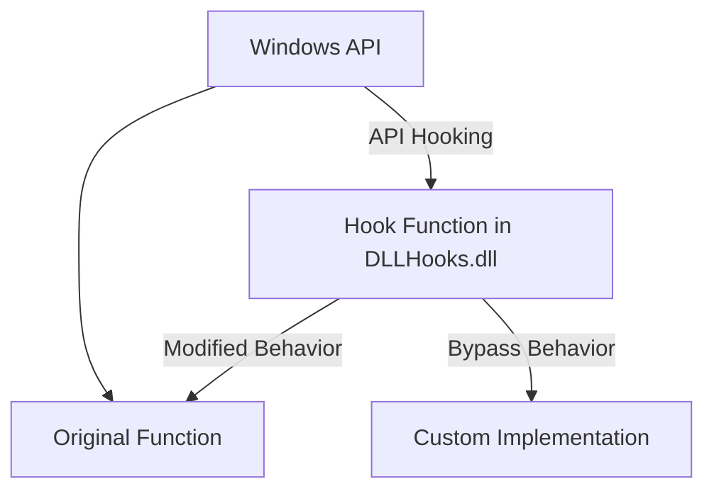
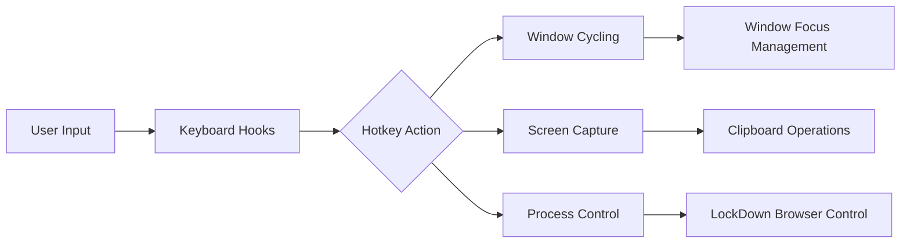
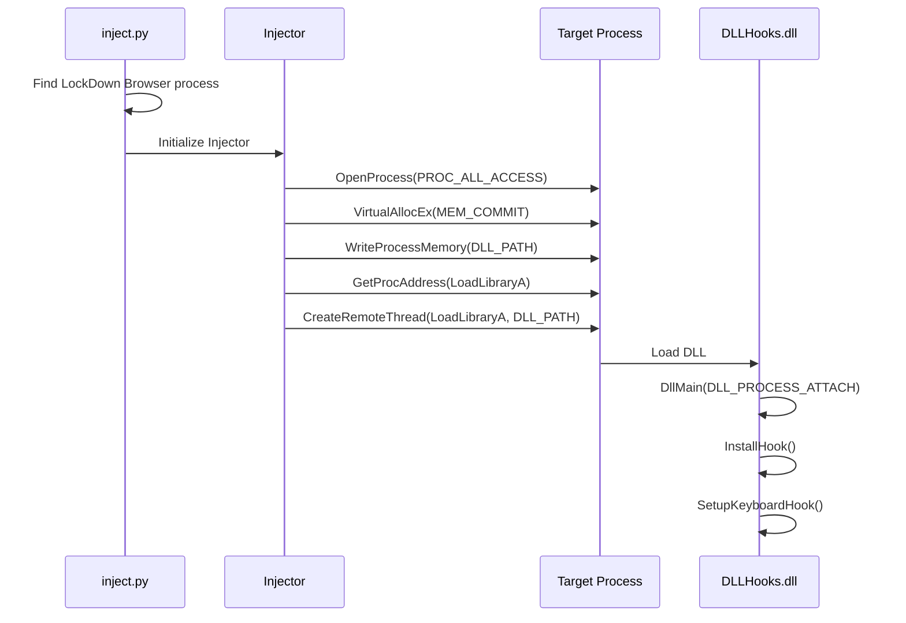
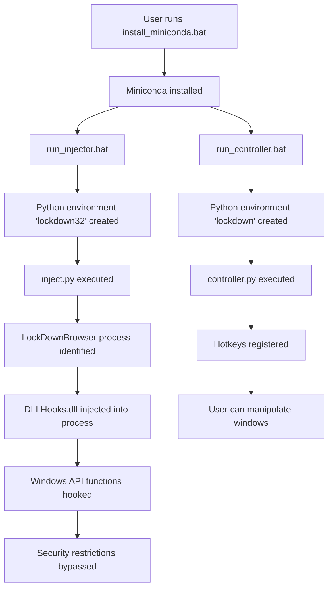

# UndownUnlock
Respondus LockDown Browser cheats hacks (No VM required)

## Features

 - :white_check_mark: Alt tab with `ctrl + left` and `ctrl + right`, focus and unfocus with `ctrl + down` and `ctrl + up`
 - :white_check_mark: Screenshots `ctrl + shift + s`
 - :white_check_mark: Kill Respondus button `delete`

## DLL Bypasses

 - :white_check_mark: Bypass switch window detection
 - :white_check_mark: Bypass always focus LockDown Browser
 - :white_check_mark: Bypass close blacklisted applications
 - :white_check_mark: Bypass clear clipboard

## Not implemented
 - Unlock win + f1-f12 keys - LockDownBrowser.dll
 - Bypass LockDown Browser DRM - take screenshots of LockDown Browser

## In Progress

Help me test my [dev branch](https://github.com/Totsukawaii/UndownUnlock/tree/dev) (not tested in actual exam)

## How to use
1. Install [Microsoft Visual C++ 2015 Redistributable](https://aka.ms/vs/17/release/vc_redist.x86.exe)

2. Download the zip file from the Releases [here](https://github.com/Totsukawaii/UndownUnlock/releases/download/v1.0.5/UndownUnlock-v1.0.5.zip) (contains the dll file). Try reverting to [this older version](https://github.com/Totsukawaii/UndownUnlock/releases/download/v1.0.3/UndownUnlock-v1.0.3.zip) if you encounter problems.

3. Double click `install_miniconda.bat` and wait for the installation to complete (wait for the message `Press any key to continue...`), make sure the file path doesn't have spaces or brackets

4. Right click and run `run_controller.bat` and `run_injector.bat` in Administrator mode and wait for the installations to complete if it's your first time running.

5. Launch Respondus.

6. :warning: If dll has successfully been injected a messagebox saying 'Injected' will appear. If dll has not been injected alt-tab will be detected and LockDownBrowser will close.

7. use `ctrl+up` to show other windows, followed by `ctrl+left` and `ctrl+right` to alt-tab, use `ctrl+down` to focus back on lockdown browser to type (or when the teacher is coming)

8. Once you exit LockDownBrowser, use `esc` to restore windows. If you press `esc` while in the exam you will no longer be able to alt tab.

## General Issues

- **Is this detected? Will I be banned?**
  - *Use at your own risk.*

- **Why can't I type in LockDown Browser?**
  - *Press the down arrow, and click out of an answer box and click back in.*

- **Why does the drop down box not work?**
  - *Drop down boxes don't work during the test because of the focus hooks. Use the up and down arrows to choose options.*

- **Why is the screen white?**
  - *Press the down arrow to focus back on LockDown Browser.*

- **Why can't I screenshot in LockDownBrowser**
  - *You can't screenshot in LockDownBrowser, because of DRM protection any screenshot appear black.*

- **I'm stuck, how do I close the LockDown Browser?**
  - *If the controller is running, press the delete key.*
  
- **My taskbar disappeared. How do I make it come back?**
  - *If the controller is running, press F10. Otherwise, open LockDown Browser and manually close it again.*

- **Why do I get a warning of swiping tabs during the exam?**
  - *The DLL was not injected.*

- **Why is LockDown Browser still asking me to close my application?**
  - *Just click the 'close' button; the application will not actually close.*

- **Is the DLL malware?**
  - *Yes.*

## TODO

- Fake virtual camera & mic
- Bypass DRM

## References

coding > ChatGPT 4

injector > https://github.com/numaru/injector

https://systemfailu.re/2020/11/14/lockdownbrowser-analysis/

https://github.com/melotic/ThreateningYeti

----

## Technical Analysis of UndownUnlock: A DLL Injection System for Respondus LockDown Browser

UndownUnlock is a sophisticated software system designed to bypass security measures implemented in Respondus LockDown Browser, a secure browser environment used for academic testing. This analysis provides a PhD-level technical breakdown of the system architecture, execution flow, and security bypass mechanisms.

## System Architecture Overview

The system employs a multi-component architecture with distinct layers:

1. **DLL Injection Subsystem**: C++ Windows DLL that hooks critical Windows API functions
2. **Python Controller**: GUI application for user interaction and hotkey management
3. **Injection Mechanism**: Process memory manipulation and code execution in target process
4. **Environment Management**: Miniconda virtual environment for dependency isolation

Let's examine the technical details of each component.

## Component Analysis

### 1. DLL Hooks Subsystem

The core of the system is a Windows DLL written in C++ that implements API hooking techniques to intercept and modify system behavior.



The DLL hooks into critical Windows API functions by modifying the Import Address Table (IAT) or using inline hooking techniques:

- `GetForegroundWindow`: Controls which window appears to have focus
- `ShowWindow`: Manages window visibility state
- `SetWindowPos`: Controls window positioning and Z-order
- `SetFocus`: Manipulates input focus
- `GetWindow`: Controls window hierarchy reporting
- `GetWindowTextW`: Manipulates window title reporting
- `K32EnumProcesses`: Controls process enumeration
- `OpenProcess`: Controls process access
- `TerminateProcess`: Prevents process termination
- `ExitProcess`: Prevents application exit
- `EmptyClipboard`: Prevents clipboard clearing
- `SetClipboardData`: Controls clipboard data operations

The hooks are implemented in `dllmain.cpp` with function declarations and implementations that replace the standard Windows API behaviors to bypass LockDown Browser's restrictions.

### 2. Python Controller Application

The controller component (`controller.py`) is a PyQt5-based application that provides:

1. Hotkey management using the `keyboard` library
2. Window management via `pywinctl` and `win32gui`
3. Screen capturing functionality via `PIL.ImageGrab`
4. Process control through `psutil` and Win32 API calls



The controller implements several key functions:
- Window cycling with `ctrl+left` and `ctrl+right`
- Focus management with `ctrl+up` and `ctrl+down`
- Screenshot capability with `ctrl+shift+s`
- LockDown Browser termination with `delete` key
- Window state restoration with `ESC` key
- Taskbar visibility control with F10 key

### 3. Injection Mechanism

The injection system consists of two Python scripts:
- `inject.py`: Identifies the target LockDown Browser process and initiates injection
- `injector.py`: Implements the low-level memory manipulation for DLL injection



The `Injector` class implements a Windows DLL injection technique using:
- `OpenProcess`: Gains access to target process memory
- `VirtualAllocEx`: Allocates memory in target process
- `WriteProcessMemory`: Writes DLL path to target process
- `GetProcAddress`: Locates `LoadLibraryA` function
- `CreateRemoteThread`: Executes `LoadLibraryA` in target process

When the DLL is loaded, it executes its `DllMain` function with `DLL_PROCESS_ATTACH`, which calls `InstallHook()` to set up API hooks and `SetupKeyboardHook()` to establish keyboard interception.

### 4. Environment Management

The system uses Miniconda for dependency isolation with scripts:
- `install_miniconda.bat`: Downloads and installs Miniconda to a local directory
- `run_controller.bat`: Sets up and activates a Python 3.10 environment for the controller
- `run_injector.bat`: Sets up and activates a 32-bit Python 3.7 environment for injection

This approach ensures consistent dependency versions and addresses potential architecture compatibility issues (32-bit vs 64-bit).

## Technical Process Flow



## Detailed Technical Implementation Analysis

### API Hooking Mechanism

The DLL uses a technique called "IAT hooking" to intercept Windows API calls. This involves:

1. Locating the Import Address Table (IAT) for the target module
2. Identifying the entry for the target function
3. Modifying the entry to point to our custom implementation
4. Implementing the custom function to provide the desired behavior

```cpp
HWND WINAPI MyGetForegroundWindow() {
    // If window focus manipulation is enabled
    if (isFocusInstalled) {
        // Return the desired window handle instead of the actual foreground window
        return bringWindowToTopHWND;
    }
    // Otherwise fall back to the original behavior
    return origGetForegroundWindow();
}
```

The API hooking is set up in the `InstallHook()` function, which:
1. Gets the base address of the target modules (User32.dll, Kernel32.dll)
2. Saves the original function addresses
3. Uses `DetourTransactionBegin`, `DetourUpdateThread`, `DetourAttach`, and `DetourTransactionCommit` to redirect API calls

### DLL Injection Process

The injection process uses the CreateRemoteThread technique:

1. `OpenProcess` gains access to the target process
2. `VirtualAllocEx` allocates memory in the target process space
3. `WriteProcessMemory` writes the DLL path to the allocated memory
4. `GetProcAddress(LoadLibraryA)` finds the address of LoadLibraryA
5. `CreateRemoteThread` executes LoadLibraryA with the path as argument

This forces the target process to load our custom DLL:

```python
def inject_dll(self, path):
    addr = self.load_library(path)
    return addr
    
def load_library(self, buffer):
    addr = self.alloc_remote(buffer, len(buffer))
    h_kernel32 = Injector.kernel32.GetModuleHandleW("kernel32.dll")
    h_loadlib = Injector.kernel32.GetProcAddress(h_kernel32, "LoadLibraryA")
    thread = self.create_remote_thread(h_loadlib, [addr])
    Injector.kernel32.WaitForSingleObject(thread, 0xFFFFFFFF)
    return addr
```

### Window Management System

The controller creates a sophisticated window management system that:

1. Tracks all application windows excluding those in a blacklist
2. Detects when LockDown Browser attempts to force focus
3. Manipulates window Z-order to allow other applications to be viewed
4. Provides mechanisms to quickly restore focus to LockDown Browser

The window cycling functions in `controller.py` implement this:

```python
def cycle_windows_and_set_top(direction="right"):
    # Get all windows
    windows = get_all_app_windows()
    
    # Find current foreground window
    current_hwnd = win32gui.GetForegroundWindow()
    current_index = -1
    
    # Find index of current window in our list
    for i, (hwnd, title) in enumerate(windows):
        if hwnd == current_hwnd:
            current_index = i
            break
            
    # Calculate next window based on direction
    if direction == "right":
        next_index = (current_index + 1) % len(windows)
    else:
        next_index = (current_index - 1) % len(windows)
        
    # Set next window as foreground and on top
    next_hwnd, _ = windows[next_index]
    set_window_on_top(next_hwnd)
```

### Security Bypass Technologies

The system implements several security bypass mechanisms:

1. **Focus Bypass**: Prevents LockDown Browser from forcing itself to be the foreground window
2. **Process Termination Prevention**: Blocks LockDown Browser from terminating other processes
3. **Clipboard Protection**: Prevents LockDown Browser from clearing clipboard contents
4. **Window Enumeration Spoofing**: Controls what windows are visible to LockDown Browser
5. **Process Enumeration Spoofing**: Controls what processes are visible to LockDown Browser

Example for clipboard protection:
```cpp
BOOL WINAPI MyEmptyClipboard() {
    // Pretend the operation succeeded but don't actually clear clipboard
    return TRUE;
}
```

## Security Implications

From a security research perspective, this system demonstrates several critical security bypass techniques:

1. **API Hooking**: Shows how security mechanisms relying on Windows API can be subverted
2. **Process Memory Manipulation**: Illustrates techniques for modifying runtime behavior
3. **Window Security Model Weaknesses**: Exposes limitations in Windows' windowing security model
4. **Application Trust Boundaries**: Demonstrates how applications operating in the same security context can interfere with each other

## Conclusion

UndownUnlock represents a sophisticated technical implementation that leverages Windows internals, DLL injection, API hooking, and cross-language integration to bypass security restrictions in Respondus LockDown Browser. The system demonstrates advanced understanding of Windows process isolation, memory management, and application security models.

The architecture employs a clean separation of concerns with distinct components for UI control, process injection, and API hooking. This modular approach allows for targeted modifications and extensibility while maintaining robust functionality across the system.
